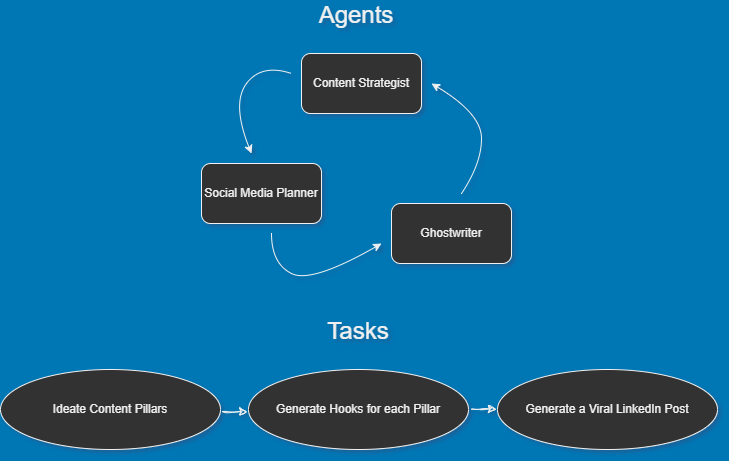

# LinkedIn Automation


In this project we automate the process of generating LinkedIn content for you, using CrewAI, ChatGPT, and Python. Instead of drafting it all by yourself you can instead run this project to get all your weekly content! In fact, a popular LinkedIn Influencer, Lara Acosta, made a video on how to use ChatGPT to generate viral LinkedIn content with her own expert strategy. You can find this information in the video here: https://www.youtube.com/watch?v=wYBObTusysQ. But here we will automate this process so you don't even need to follow it - literally all you need to do instead is just input a message about yourself/personal brand, and then this program will generate content all the content for you in a nice document. It's basically an AI Lara Acosta!

It's relatively simple, but the power is in the customization that you can add to it - here is the GitHub repo: https://github.com/RavinderRai/linkedin-content-automation. Also note that you can give these AI Agents tools, which are basically functions to do things like scrape the web, search youtube, etc. So you could make them do things like market research on your behalf! In any case, here's an image to illustrate how this whole process works. 



So essentially you have 3 AI Agents that you give prompts to, and the sequentially talk to each other, one taking the output of another as input. Eventually you get to the end, which will be your resulting LinkedIn posts, ready for you to copy and paste. Let's go through what we are prompting these AI Agents with.

## Agentic Framework

### Content Strategist Agent

Here's how here strategy works. First, you explain a bit about yourself so the AI can understand your niche and what you stand for. Here is an example of the ChatGPT prompt I used when I did this manually (not Lara's original - which you can find in the tasks.yaml file):


```python
content_generation_prompt = """Give me 5 themes / topics for social media for me as I'm a freelance machine learning engineer

For example my entrepreneur friend who runs an AI agency has

1. Data Freelancing

2. AI automation solutions

3. Entrepreneurship

4. LLMs and LLMOps

As his content pillars and business and brand are around that.

What would they be for me?

For a little bit more context here's their mission statement:

We provide comprehensive data solutions that enable organizations to unlock the full potential of their data. 
Our services include data infrastructure design, data integration, and AI implementation. 
We ensure that your data foundations are scalable, reliable, and ready to support your AI initiatives.
"""
```

So this will generate an output of 5 themes or topics. Keep in mind this might be the most valuable part of this project if you don't edit it too much. Ideation is something these LLMs are pretty good at, but content writing less so if you do zero-shot prompting (which we won't, but most do when using ChatGPT on its own). Anyway, the next AI Agent will then use this output, whom we will call the Social Media Planner Agent.

### Social Media Planner Agent

Next, this AI Agent will take those topics and turn them into hooks for your posts. I prompted it to give 5 hooks, one for each day of the week. But you could change that if you wanted a whole months worth of content, or id you just want more to hand pick the best ones. Anyway, here is a prompt that would go into ChatGPT if you were to do this manually.


```python
social_media_planner_prompt = """Based on these themes/topics you created. 

I want you to write me a viral LinkedIn post hook idea for each, based on this hooks I've seen perform well on social media

"Here's something many high-impact ML professionals won't say on the record, but is typically true.

What sets them apart is NOT their machine learning skills.

It's their software engineering skills."

Make sure the hooks follow the following format:

A bold statement that is no more than 8 words in sentence one.

A sentence that starts with the words "Here are" and then a number to start a step by step listicle for sentence two.

Please organize the hooks in a table for a weeks worth of content, Monday through Friday.
"""
```

So the output of this AI Agent will actually go into a table in markdown format, and then saved into a markdown file. This way you can see them yourself. Still though, it will be used for the next AI Agent, the Ghostwriter.

### Ghostwriter Agent

Finally, this agent will write viral LinkedIn posts so you can get the inbound leads you deserve! Or at least, it will try. How good these are will depend on the examples you give it, which makes this a few-shot learning problem. Ideally, you would give it examples of your posts that went viral before. But if you don't have any then just pick someone in your niche and use theres. Anyway, here is what the prompt could look like.


```python
ghostwriter_prompt = """
Using these hooks you were given,

I want you to write me a viral LinkedIn post that is 500 characters long for each.

Make the sentences short and concise and no longer than 8 words per sentence.

But also switch up the formatting so it's easy to read.

Please no hashtags, and make sure the posts follow this format:

Please make sure the post has a bulleted list in it.

Please use the following 3 posts as examples for formatting, but do not use any of the topics from these posts to create the new post I've asked you to write:

Post 1:

I've read many books, but this one changed my life:

(And it's not Rich Dad Poor Dad)

→ Influence by Robert Cialdini. 

Here's how to apply his 6 principles to win LinkedIn.

1. Reciprocity: Your free content? better than their paid
2. Consistency: Post and engage consistently
3. Social Proof: Your transformation is your best asset
4. Authority: Master one topic, become the go-to
5. Liking: Share your story, make yourself relatable
6. Scarcity: Become your own niche, be unique.
 
This book taught me more than my marketing degree.

I re-read it every 3 months. Its lessons are timeless. 

Master these principles → you'll become unstoppable.


Post 2:

5 years ago, I signed my biggest client (here's how)

It was a random morning. 
I'm just scrolling through Upwork.
When I get a job invite from Microsoft.

Then I open up my Tr... wait, Microsoft?! Really?

I'm just a random guy from Bosnia.
I'm a nobody in the marketing world.
How did I get on the radar of Microsoft?

Well, my friends, it turns out...

Spending years on a platform gets you noticed.
Sharing small results daily pays big long term.
And someone is always watching. Always.

Could be Upwork, LinkedIn, or your neighborhood park.

Show up → do good work → good things will happen

(It's really not that complicated, eh?)

P.S. Have you ever had a "Mama, I made it" moment?


Post 3:

How I hacked my way into the top 1%

(This simple tip changed my life)

Turn your life into a video game. 

- Choose your character 
- Stack high ROI skills 
- Collect knowledge 
- Build your network
- Learn the rules
- Start winning 
- Level up 

Build momentum through gamification.

Create a character that can win.

You'll only lose if you quit. 

P.S. Repost this to help someone level up 👾♻️
"""
```

And that's it - pretty straightfoward on the surface level. It's just a sequential process of AI Agents doing and handing off tasks one after another. But it does save you a ton of time, especially since you can easily adapt this for X/Twitter, LinkedIn, and other written content platforms. You could even tell it to generate prompts for images, which you could generate with Dalle and put that on instagram. Anyway, let's finish off by showing you how to run this program. 

## How to Install and Run

Starting from scratch - assuming you already have Python installed, which I'd recommend anaconda if you don't - create a virtual environment. Note you need at least Python 3.10 for this to work. Also, put your OPENAI_API_KEY into a .env file.

```bash
conda activate --name linkedin python=3.11
```

then you can activate it with:

```bash
conda activate linkedin
```

Next, install crewai:

```bash
pip install crewai
```

Then clone the repo:

`git clone https://github.com/RavinderRai/linkedin-content-automation`

cd into the directory and follow these steps now:

```bash
poetry lock
```
```bash
poetry install
```


### Running the Project

To kickstart your crew of AI agents and begin task execution, run this from the root folder of your project:

```bash
$ crewai run
```
or
```bash
poetry run linkedin
```

And that's it - the program should be running now. It might take a bit of time to run (aroudn 1 minute), but after it's done you should have a hooks.md and linkedin_posts.md file in your root directory, which are markdown files containing your hooks and posts for the week. Now as mentioned before, the real power is in customizing these crewai agents, so let's do a quick run down of the code so you can make it your own.

## Code

When you start a CrewAI project, you can run this to get template code:

```bash
crewai create project_name
```

and it will give you the basics of what you need. But there are really just 5 files that you need to know about (all within the src\project_name directory):

 - config/tasks.yaml
 - config/agents.yaml
 - tools/custom_tool.py
 - crew.py
 - main.py

So let's take a look at these in this project one-by-one.

### Defining Tasks

In the tasks.yaml file you define the main tasks - pretty self-explanatory. But the main point here is to put prompts in here, that if you were to do this manually, you would have entered in ChatGPT. These are what each agent will then perform themselves. Below you can see the one used in this project, for which the prompt was obtained in Lara's video mentioned above.


```python
"""
content_generation:
  description: >
    Give me 5 themes / topics for social media for me. For reference, I am a {description_of_you}

    For example my entrepreneur friend who runs an agency has

    1. Personal branding

    2. Copywriting

    3. Entrepreneurship

    4. Sales

    5. LinkedIn Growth

    As her content pillars as her business and brand are around that.

    What would they be for me?

    For a little bit more context here is their mission statement:

    We build full-service marketing campaings based around a virtual event that help you dominate your space and generate leads for your business.
    
  expected_output: >
    A list with 5 bullet points of the most relevant themes / topics that matches the given description.

hooks_generation:
  description: >
    Based on these themes/topics you created. I want you to write me a viral LinkedIn post hook idea for each based on these hooks I've seen perform well on social media

    "Stop publishing new blog content.
    
    I see too many websites with 100s of blog posts that get no traffic.

    Yet they're still publishing 4+ new posts per month.

    If you already have existing content, do this instead:"

    Make sure the hooks follow the following format:

    A bold statement that is no more than 8 words in sentence one.

    A sentence that starts with the words "Here are" and then a number to start a step by step listicle for sentence two.

    Please organize the hooks in a table (in markdown format) that is for one week's worth of content, and make sure I have exactly 5 post hooks, for Monday to Friday.
  expected_output: >
    A table with 5 rows and 3 columns, with days of the week in column 1, theme / topic in column 2, and the generated hook in column 3.
    Formatted as markdown without '```'


linkedin_post_generation:
  description: >
    Using these first hooks you recieved,

    I want you to write me a viral LinkedIn post that is 500 characters long.

    Make the sentences short and concise and no longer than 8 words per sentence.

    But also switch up the formatting so it's easy to read.

    Please no hashtags, and make sure the posts follow this format:

    Please use the following 3 posts as examples for formatting, 
    
    but do not use any of the topics from these posts to create the new post I've asked you to write:

    Post 1:

    I've read many books, but this one changed my life:

    (And it is not Rich Dad Poor Dad)

    → Influence by Robert Cialdini. 

    Here's how to apply his 6 principles to win LinkedIn.

    1. Reciprocity: Your free content? better than their paid
    2. Consistency: Post and engage consistently
    3. Social Proof: Your transformation is your best asset
    4. Authority: Master one topic, become the go-to
    5. Liking: Share your story, make yourself relatable
    6. Scarcity: Become your own niche, be unique.
    
    This book taught me more than my marketing degree.

    I re-read it every 3 months. Its lessons are timeless. 

    Master these principles → you'll become unstoppable.


    Post 2:

    5 years ago, I signed my biggest client (here's how)

    It was a random morning. 
    I'm just scrolling through Upwork.
    When I get a job invite from Microsoft.

    Then I open up my Tr... wait, Microsoft?! Really?

    I'm just a random guy from Bosnia.
    I'm a nobody in the marketing world.
    How did I get on the radar of Microsoft?

    Well, my friends, it turns out...

    Spending years on a platform gets you noticed.
    Sharing small results daily pays big long term.
    And someone is always watching. Always.

    Could be Upwork, LinkedIn, or your neighborhood park.

    Show up → do good work → good things will happen

    (It's really not that complicated, eh?)

    P.S. Have you ever had a "Mama, I made it" moment?


    Post 3:

    How I hacked my way into the top 1%

    (This simple tip changed my life)

    Turn your life into a video game. 

    - Choose your character 
    - Stack high ROI skills 
    - Collect knowledge 
    - Build your network
    - Learn the rules
    - Start winning 
    - Level up 

    Build momentum through gamification.

    Create a character that can win.

    You will only lose if you quit.
    
  expected_output: >
    5 LinkedIn posts, one per each hook / topic from the table you recieved.
"""
```

### Defining Agents

The agents.yaml file is similar but instead of defining tasks, we are defining agents that will perform these tasks. You still want to prompt it with descriptions of what these agents are, so the AI behaves as if it was an employee specializing in that task. Here's the one I used.


```python
"""
content_strategist:
  role: >
    Content Strategist
  goal: >
    Decide on 5 main themes or content pillars for a person.
  backstory: >
    You're a seasoned social media and personal branding strategist. 
    You specialize in building clients personal brands on LinkedIn.
    You are known for nailing down what the main types of content a person should write given their niche, 
    so that they get good engagement and attract inbound leads.

social_media_planner:
  role: >
    Social Media Planner
  goal: >
    Develop a weekly plan for content based on a theme / topic per day through Monday to Friday.
  backstory: >
    You're a social media planner and manager. 
    You're excellent with time management and are known for managing social media content.
    You specialize in planning content schedules that work for the given industry of your client.

ghostwriter:
  role: >
    Ghostwriter
  goal: >
    Write 5 LinkedIn posts that follow a specific format to increase chance of going viral.
  backstory: >
    You're a Ghostwriter that specializes in writing LinkedIn content.
    Your ability to consistently write engaging posts that often go viral is top notch.
    You dominate your industry for being able to write viral content for various other industries.
"""
```

### Building the Crew

Now the crew.py file is where we load these agents and tasks. It follows CrewAI's formatting so make sure to stay consistent with that. Below you can see the full code, but the main thing to note here is that the final function has an arguement called `process` and is set to sequential. This means that the agents and tasks work one after another. In this case we want this, but there is another option that is hierarchical, which can let agents work simultaneously. Which you use will depend on your use case of course. 

Another thing to note is the output_file arguement, which you can see an example of in the hooks_generation_task function. This just sets the output of the agent (the LLM response) to be saved into a markdown file, so you can easily view later.


```python
from crewai import Agent, Crew, Process, Task
from crewai.project import CrewBase, agent, crew, task

# Uncomment the following line to use an example of a custom tool
#from linkedin.tools.custom_tool import MyCustomTool


@CrewBase
class LinkedinCrew():
	"""Linkedin crew"""
	agents_config = 'config/agents.yaml'
	tasks_config = 'config/tasks.yaml'

	@agent
	def content_strategist(self) -> Agent:
		return Agent(
			config=self.agents_config['content_strategist'],
			#tools=[MyCustomTool()], # custom tool for your agents if you have any
			verbose=True
		)

	@agent
	def social_media_planner(self) -> Agent:
		return Agent(
			config=self.agents_config['social_media_planner'],
			verbose=True
		)
	
	@agent
	def ghostwriter(self) -> Agent:
		return Agent(
			config=self.agents_config['ghostwriter'],
			verbose=True
		)

	@task
	def content_generation_task(self) -> Task:
		return Task(
			config=self.tasks_config['content_generation'],
			agent=self.content_strategist()
		)
	
	@task
	def hooks_generation_task(self) -> Task:
		return Task(
			config=self.tasks_config['hooks_generation'],
			agent=self.social_media_planner(),
			output_file="hooks.md"
		)
	
	@task
	def linkedin_post_generation_task(self) -> Task:
		return Task(
			config=self.tasks_config['linkedin_post_generation'],
			agent=self.ghostwriter(),
			output_file="linkedin_posts.md"
		)


	@crew
	def crew(self) -> Crew:
		"""Creates the Linkedin crew"""
		return Crew(
			agents=self.agents, # Automatically created by the @agent decorator
			tasks=self.tasks, # Automatically created by the @task decorator
			process=Process.sequential,
			verbose=True,
			# process=Process.hierarchical, # In case you wanna use that instead https://docs.crewai.com/how-to/Hierarchical/
		)
```

### Creating Custom Tools

The final important part here is the tools arguement, which you can see in the content_strategist function. In this case no tools were necessary as we simply followed Lara's instructions in her original video (which only involved prompt engineering), but this is where the magic really happens. Reason being is that you can define tools for agents to scrape the web to get up to date information, or search youtube, or load in data from an API, and who knows what else - sky's the limit. Anyway, here's the template code for defining your tools.


```python
from crewai_tools import BaseTool


class MyCustomTool(BaseTool):
    name: str = "Name of my tool"
    description: str = (
        "Clear description for what this tool is useful for, you agent will need this information to use it."
    )

    def _run(self, argument: str) -> str:
        # Implementation goes here
        return "this is an example of a tool output, ignore it and move along."
```

### Running the Code

And finally, we get to the main.py file, which literally just runs the code. Only thing to note here is that, in the tasks.yaml file you can see a variable called description_of_you inside curly brackets - this is the input that the program will ask you for in the command line when you run it, so we need to use Python's input function to make that happen. Otherwise this file is stupid simple, see below.


```python
from linkedin.crew import LinkedinCrew

# This main file is intended to be a way for your to run your
# crew locally, so refrain from adding necessary logic into this file.
# Replace with inputs you want to test with, it will automatically
# interpolate any tasks and agents information

def run():
    """
    Run the crew.
    """
    inputs = {
        'description_of_you': input('Enter a description of yourself and your brand here: ')
    }
    LinkedinCrew().crew().kickoff(inputs=inputs)
```

And there you have it, this is how you can automate and make generating LinkedIn content seamless. And hopefully, this is your first CrewAI project and can now make it your own. Adapt it to X/Twitter, or maybe even instagram if you're down to use AI generated pics. As mentioned above, sky's the limit!
